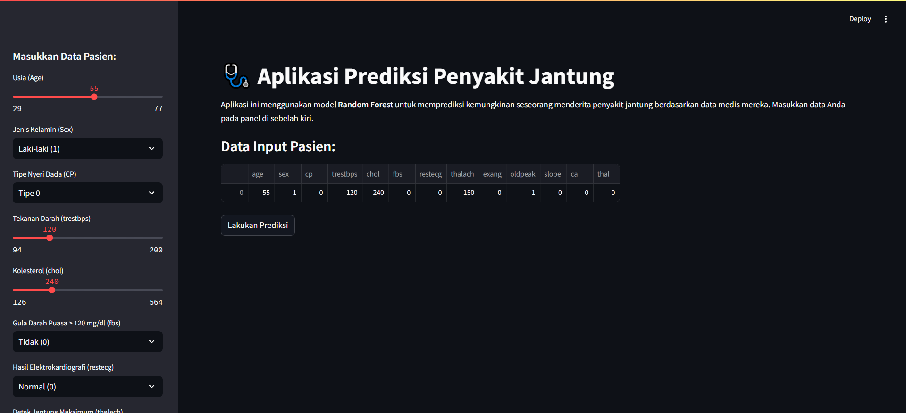

# 🩺 Proyek Klasifikasi Penyakit Jantung

Repositori ini berisi proyek _data science_ untuk membangun dan mengevaluasi model _machine learning_ yang dapat memprediksi keberadaan penyakit jantung pada pasien. Proyek ini mencakup alur kerja _end-to-end_, mulai dari analisis data, perbandingan model, optimasi, hingga _deployment_ dalam bentuk aplikasi web interaktif.



---

##  Deskripsi Proyek

Tujuan utama proyek ini adalah untuk menerapkan alur kerja ilmu data secara lengkap. Model klasifikasi dengan performa terbaik (Random Forest) dioptimalkan dan disimpan untuk digunakan dalam aplikasi web berbasis Streamlit, yang memungkinkan prediksi secara _real-time_.

---

## Dataset

Dataset yang digunakan adalah `heart_desease_data.csv`, yang berisi 14 atribut medis. Variabel target `target` menunjukkan keberadaan penyakit jantung (1) atau tidak (0).

**Fitur utama:**
- **age**: Usia pasien
- **sex**: Jenis kelamin (1 = laki-laki; 0 = perempuan)
- **cp**: Tipe nyeri dada (_chest pain type_)
- **trestbps**: Tekanan darah saat istirahat
- **chol**: Kadar kolesterol
- **thalach**: Detak jantung maksimum yang tercapai

---

## ⚙️ Alur Kerja Proyek

1.  **Eksplorasi Data (EDA)**: Menganalisis data secara visual untuk memahami distribusi, korelasi, dan hubungannya dengan variabel target.
2.  **Pra-pemrosesan Data**: Melakukan penskalaan fitur menggunakan `StandardScaler` untuk menormalisasi rentang nilai data.
3.  **Perbandingan Model**: Melatih dan mengevaluasi 5 model klasifikasi (Logistic Regression, Naive Bayes, SVM, Decision Tree, dan Random Forest).
4.  **Optimasi Model**: Menggunakan `GridSearchCV` untuk mencari kombinasi _hyperparameter_ terbaik dari model Random Forest yang terpilih.
5.  **Validasi Akhir**: Mengevaluasi model final menggunakan **10-Fold Cross-Validation** untuk mendapatkan estimasi performa yang stabil.
6.  **Penyimpanan Model**: Menyimpan model dan _scaler_ ke dalam file `.sav` menggunakan `joblib`.

---

## 📊 Hasil & Performa Model

Setelah melalui proses perbandingan dan optimasi, **Random Forest** memberikan performa terbaik.

- **Akurasi Awal (Default):** 81.96%
- **Akurasi Setelah Tuning:** **86.88%** 🚀

Evaluasi dengan _10-Fold Cross-Validation_ pada model yang telah dioptimalkan menunjukkan **akurasi rata-rata yang stabil**, membuktikan bahwa model ini dapat diandalkan.

---

## 🛠️ Teknologi yang Digunakan

- **Analisis Data:** Python, Pandas, Matplotlib, Seaborn
- **Machine Learning:** Scikit-learn
- **Deployment:** Streamlit, Joblib
- **Lingkungan Kerja:** Jupyter Notebook

---

## 🚀 Cara Menjalankan Proyek

Berikut adalah panduan langkah demi langkah untuk menjalankan proyek ini di komputer Anda.

### 1. Prasyarat

Pastikan perangkat Anda sudah terpasang:
- [Python 3.7+](https://www.python.org/downloads/) (Pastikan mencentang "Add Python to PATH" saat instalasi).
- [Git](https://git-scm.com/downloads/) (Untuk meng-clone repositori).

### 2. Panduan Instalasi

**a. Clone Repositori**

Buka terminal atau CMD, lalu jalankan perintah berikut:
```bash
git clone [https://github.com/NAMA_USER_ANDA/NAMA_REPO_ANDA.git](https://github.com/NAMA_USER_ANDA/NAMA_REPO_ANDA.git)
cd NAMA_REPO_ANDA
